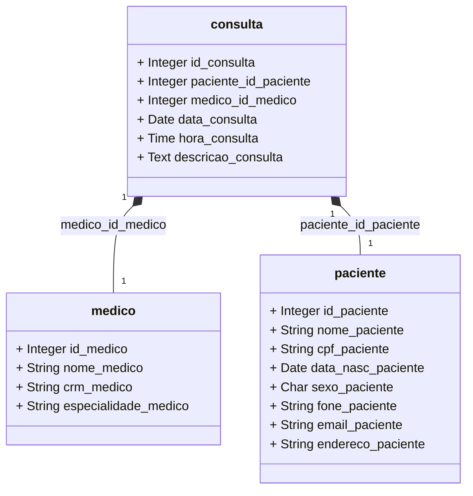

<b>Banco de Dados de uma Clínica:</b> 
Projeto para a disciplina Programação Web na faculdade.
Para funcionar é necessário ter o Bootstrap instalado na mesma pasta com os arquivos como visto na imagem a seguir:

<b>Diagrama de classes</b>

<b>Dependências:</b> 
<b>Bootstrap</b>- use o link abaixo ou pesquise no seu navegador-
https://getbootstrap.com . 
<b>SQL</b> feito pelo <b>DBDesigner</b>.

<b>Atenção:</b> 
Para usar o projeto, lembre-se de alterar o diretório no começo dos códigos e verifique o nome colocado nas tabelas.